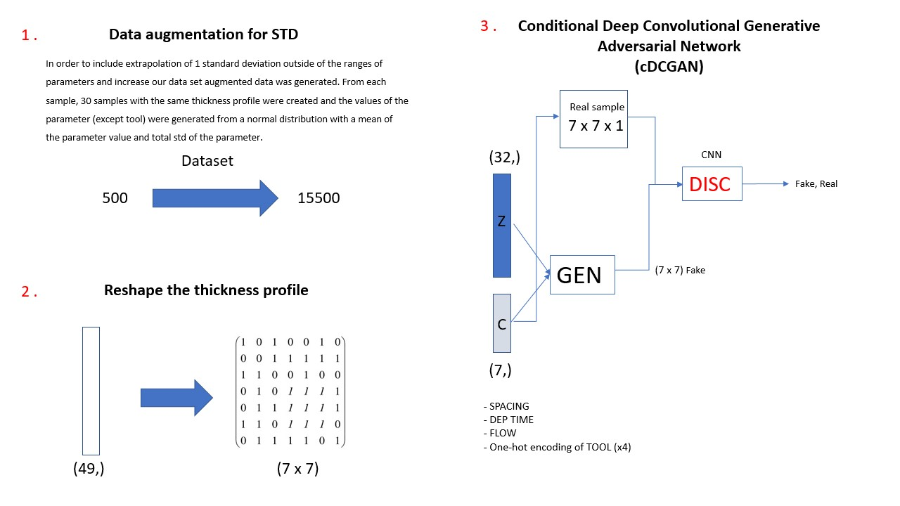

# conductive.ai Take-home assignment

## Description:
A semiconductor fab is performing a SATEOS CVD process on 4 different AMAT PRODUCER SE tools.

They have performed Design of Experiments on 500 300mm wafers by varying 3 process parameters:

- Flowfactor: inversely proportional to TEOS (precursor) flow. Actual flow value not accessible at the moment.
- Spacing: distance between shower head and wafer.
- Deposition Time.

Temperature was held constant at 480 celsius. The fab wants to know how would film thickness change if they would change the temperature in the range of 460-500 celsius.

They chose 125 parameter combinations (recipes) and performed each of them on 4 different tools to account for tool variation.

Film thickness values were measured (in angstrom) at 49 specific points on the wafer (sites). The spec is 1500Å.

Coordinates of the sites are given in a separate file. Values are in micrometers, (0,0) is the center of the wafer.

### Task:
 - Reconstruct wafer profile images from sites using interpolation.
 - Build a generative machine learning model (VAE, GAN, or similar) that predicts the thickness profile of the wafer based on flowfactor, spacing, deposition time, and tool.
 - Ensure that the machine learning model is capable of extrapolating 1 standard deviation outside of the ranges of parameters in accordance with physics.

- (Bonus) Build a physics-based model (preferably using simulations) for this process that would include temperature. If you need information on other process parameters, we'd be happy to provide them if available. Adapt it to fit the data. Combine it with the ML model to incorporate the influence of temperature.
## GAN model solution:

## Model evalution:

### Please review the following notebooks and files for the evaluation:

 - Data analysis, 3D interpolation and Augmented data generation: **visualization.ipyn
 - Conditional Deep Convolutional GAN model training: **GANS-7x7.ipyn
 - Generator Python file to generate a new 3D interpolation of the profile thickness: run **generator.py  
